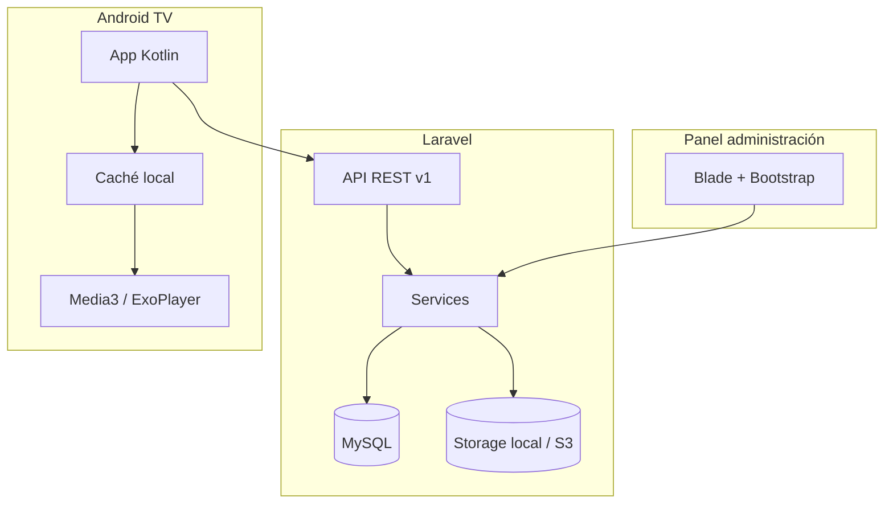

# Arquitectura — Cartelería digital municipal

## Resumen

Plataforma centralizada compuesta por:

1. **Panel web** (Laravel + Blade + Bootstrap): administración de pantallas, contenido, playlists, programación y mensajes urgentes.
2. **API REST** (`/api/v1/`): consumida por dispositivos Android TV (Etapa 8+).
3. **App Android TV** (Kotlin + Media3): vinculación, sincronización local y reproducción (Etapas 10+).

## Capas (backend)

| Capa | Responsabilidad |
|------|-----------------|
| Controllers | HTTP, respuestas, delegación |
| Form Requests | Validación de entrada |
| Policies | Autorización por rol/recurso |
| Services | Reglas de negocio (manifiesto, programación, vinculación) |
| Jobs | Procesamiento de media, limpieza, invalidación de manifiesto |
| Models | Persistencia y relaciones Eloquent |

## Resolución de contenido en pantalla

Prioridad (de mayor a menor):

1. Mensaje urgente activo (global o pantalla específica).
2. Programación vigente (fecha + reglas horarias opcionales).
3. Playlist asignada por defecto a la pantalla o a un grupo al que pertenece.

El campo `screens.manifest_version` se incrementará cuando cambie lo que debe sincronizar/reproducir un dispositivo (Etapa 8).

## Almacenamiento de archivos

- Disco configurable por registro (`media_assets.disk`, por defecto `local`).
- Campos `path` + `checksum_sha256` para integridad y migración futura a S3.

## Seguridad (diseño)

- Token de dispositivo: solo hash en `screens.device_token_hash`.
- Códigos de vinculación: tabla `pairing_codes`, expiración y un solo uso.
- Fechas en UTC; interpretación con `settings.app.timezone`.

## Diagrama de componentes

## Estado del proyecto

| Etapa | Estado |
|-------|--------|
| 1 — Base de datos | Completada |
| 2 — Panel base (auth, layout, dashboard) | Completada |
| 3 — Pantallas (CRUD + vinculación) | Completada |
| 4 — Biblioteca multimedia | Completada |
| 5 — Playlists | Completada |
| 6 — Asignación pantallas y grupos | Completada |
| 7 — Programación | Completada |
| 8 — API dispositivos | Completada |
| 9 — Mensajes urgentes | Completada |
| 10 — Android TV (vinculación) | Completada (`android/`) |
| 11 — Android TV (sync local) | Completada |
| 12 — Android TV (Media3) | Completada |
| 13 — Monitoreo ampliado (dashboard) | Completada |
| 14 — Urgentes UI Android | Completada |
| 15 — Pruebas, seguridad, producción | Completada |

## Panel web (Etapa 2)

- Autenticación por sesión (login / logout con CSRF).
- Layout institucional Bootstrap 5 + sidebar responsive.
- Middleware `role:admin` para rutas administrativas.
- Gates: `manage-users`, `manage-settings`, `manage-content` (para módulos futuros).
- Dashboard con métricas desde `DashboardService` y umbral online/offline vía `SettingStore`.
